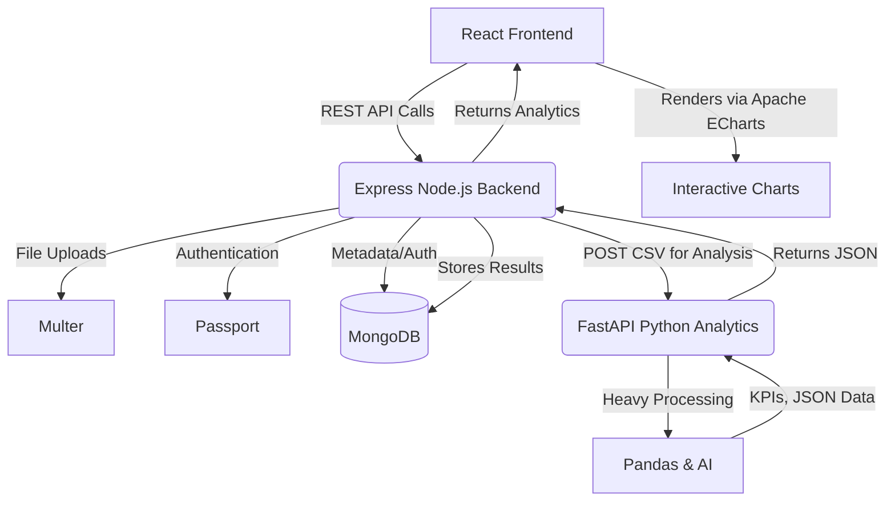

# Sales Intelligence Platform

A modern, scalable microservice-based architecture for processing and visualizing sales analytics. This platform separates concerns by delegating heavy data processing to a dedicated Python service while maintaining a high-performance Express/Node.js backend and a beautiful React frontend.

## 🏗️ Architecture Design

The core philosophy of this project is strict separation of concerns, ensuring that **Node.js never executes Pandas/data science code**, and **Python never directly handles MongoDB or frontend templates**.



## 🚀 Key Features

*   **Decoupled Services**: Dedicated Python (FastAPI) layer for all data science operations, communicating with the Express backend purely via JSON.
*   **Performance First**: The Node.js backend handles authentication, user sessions, and database persistence, avoiding single-threaded event loop blocking that occurs if data processing runs on Node.
*   **Modern Frontend**: Built with React (Vite) utilizing Tailwind CSS v4, React Query, and GSAP for micro-animations, providing a seamless and highly responsive UI.
*   **Robust Backend**: Express.js server leveraging Passport for authentication, Mongoose for MongoDB ODM, and Joi for request validation.
*   **Data Visualization**: Data processed by Pandas is sent to the frontend as raw JSON and rendered client-side, giving complete UI control to the React layer.

## 🛠️ Technology Stack

### Frontend (`/client`)
*   **Framework**: React 19 (via Vite)
*   **Styling**: Tailwind CSS v4
*   **State / Data Fetching**: React Query (`@tanstack/react-query`)
*   **Routing**: React Router DOM v7
*   **Animations**: GSAP
*   **Icons**: Lucide React
*   **HTTP Client**: Axios

### Backend (`/server`)
*   **Runtime**: Node.js
*   **Framework**: Express.js
*   **Database**: MongoDB (via Mongoose)
*   **Authentication**: Passport.js (Local Strategy), bcrypt
*   **Validation & Security**: Joi, Helmet, CORS
*   **Logging**: Winston

### Analytics (Planned Microservice)
*   **Framework**: FastAPI (Python)
*   **Data Processing**: Pandas, NumPy
*   **Machine Learning**: scikit-learn

## 📁 Project Structure

```text
Major Project/
├── client/                 # React Frontend Application
│   ├── public/             # Static assets
│   ├── src/                # React source code (components, pages, hooks)
│   ├── package.json        # Frontend dependencies
│   └── vite.config.js      # Vite configuration
├── server/                 # Express Node.js Backend
│   ├── src/                # Backend source code (controllers, routes, models, utils)
│   ├── logs/               # Winston log outputs
│   ├── server.js           # Server entry point
│   └── package.json        # Backend dependencies
├── Concept.md              # Architectural design principles and guidelines
└── README.md               # This documentation file
```

## ⚙️ Prerequisites

Before you begin, ensure you have the following installed:
*   [Node.js](https://nodejs.org/) (v18+ recommended)
*   [MongoDB](https://www.mongodb.com/) (Local instance or MongoDB Atlas URI)
*   [Python 3.8+](https://www.python.org/) (For the upcoming Analytics service)

## 💻 Installation & Setup

### 1. Clone the repository

```bash
git clone <your-repo-url>
cd "Major Project"
```

### 2. Backend Setup (`/server`)

1. Navigate to the server directory:
   ```bash
   cd server
   ```
2. Install dependencies:
   ```bash
   npm install
   ```
3. Environment Configuration:
   * Copy `.env.example` to `.env` (or create a new `.env` file).
   * Ensure your `.env` contains your MongoDB connection string and Session Secrets:
     ```env
     PORT=5000
     MONGODB_URI=mongodb://localhost:27017/sales_platform
     SESSION_SECRET=your_secure_session_secret
     ```
4. Start the development server:
   ```bash
   npm run dev
   ```
   *The server should now be running on `http://localhost:5000` (or the port specified in `.env`).*

### 3. Frontend Setup (`/client`)

1. Open a new terminal window and navigate to the client directory:
   ```bash
   cd client
   ```
2. Install dependencies:
   ```bash
   npm install
   ```
3. Environment Configuration:
   * Create a `.env` file in the client root if it doesn't exist, and set your API URL:
     ```env
     VITE_API_URL=http://localhost:5000/api
     ```
4. Start the Vite development server:
   ```bash
   npm run dev
   ```
   *The frontend should now be running, typically on `http://localhost:5173`.*

## 📈 Future Implementation: Python Analytics Service

The architecture is explicitly designed to integrate a Python FastAPI service. When implemented, the flow will be:
1. User uploads a CSV file via React to the Node.js Express server.
2. Express temporarily saves the file and forwards it to the Python FastAPI service.
3. Python/Pandas reads the CSV, calculates KPIs, models forecasts, and structures the analytics data.
4. Python returns only raw JSON (no images or HTML).
5. Express persists the analytics JSON to MongoDB and returns it to React.
6. React uses a client-side charting library to visualize the metrics dynamically.

## 🤝 Contributing
Please read through `Concept.md` to fully understand the architectural patterns and boundaries of this project before submitting Pull Requests.

## 📄 License
This project is licensed under the MIT License.
