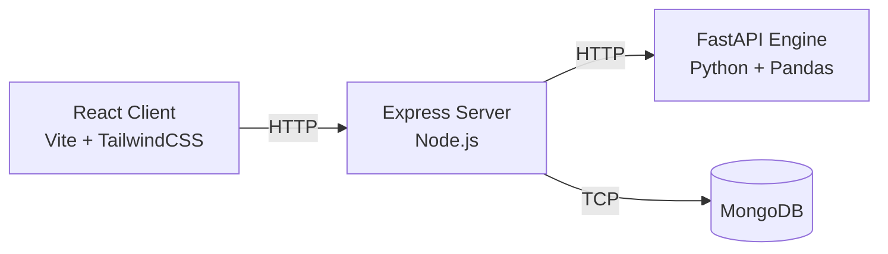

# SalesIntel — Sales Intelligence Platform

> AI-powered sales analytics dashboard. Upload CSV data, get instant insights with interactive charts, KPIs, and exportable reports.


---

## Architecture


```mermaid
graph LR
    A[React Client<br/>Vite + TailwindCSS] -->|HTTP| B[Express Server<br/>Node.js]
    B -->|HTTP| C[FastAPI Engine<br/>Python + Pandas]
    B -->|TCP| D[(MongoDB)]
```

| Service | Tech Stack | Port |
|---------|-----------|------|
| **Client** | React 19, Tailwind v4, ECharts, TanStack Query | `5173` (dev) / `80` (prod) |
| **Server** | Express, Passport, Mongoose, Multer, Winston | `5000` |
| **Analytics** | FastAPI, Pandas, NumPy, Pydantic | `8000` |
| **Database** | MongoDB 7 | `27017` |

---

## Features

- **Project management** — Create, organize, and manage analytics projects
- **CSV upload & validation** — Drag-and-drop with client + server validation (10MB limit)
- **Real-time analytics** — Revenue trends, top products, category breakdowns, regional sales
- **Interactive dashboard** — Drill-down filters, comparison mode, dark/light theme
- **Data export** — PDF, Excel, CSV export from any dashboard
- **Security** — Helmet, rate limiting, session-based auth, input validation

---

## Prerequisites

- **Node.js** ≥ 20
- **Python** ≥ 3.11
- **MongoDB** ≥ 7 (local or Atlas)
- **Docker** (optional, for containerized setup)

---

## Quick Start — Local Development

### 1. Clone the repository

```bash
git clone https://github.com/vivekmisar/Saas_Sales_Application.git
cd Saas_Sales_Application
```

### 2. Start MongoDB

```bash
# Using Docker
docker run -d -p 27017:27017 --name mongo mongo:7

# Or install locally: https://www.mongodb.com/docs/manual/installation/
```

### 3. Express Server

```bash
cd server
cp .env.example .env    # Edit with your values
npm install
npm run dev             # Starts on http://localhost:5000
```

### 4. FastAPI Analytics Engine

```bash
cd analytics-engine
python -m venv venv

# Windows
venv\Scripts\activate
# macOS/Linux
source venv/bin/activate

pip install -r requirements.txt
uvicorn app.main:app --reload --port 8000
```

### 5. React Client

```bash
cd client
cp .env.example .env    # Edit if needed
npm install
npm run dev             # Starts on http://localhost:5173
```

---

## Quick Start — Docker

```bash
# From project root
docker compose up --build
```

This starts all 4 services:
- Client → http://localhost
- Server → http://localhost:5000
- Analytics → http://localhost:8000
- MongoDB → localhost:27017

---

## Environment Variables

### Server (`server/.env`)

| Variable | Required | Default | Description |
|----------|----------|---------|-------------|
| `NODE_ENV` | No | `development` | Environment mode |
| `PORT` | No | `5000` | Server port |
| `MONGODB_URI` | **Yes** | — | MongoDB connection string |
| `SESSION_SECRET` | **Yes** | — | Session encryption key |
| `CLIENT_URL` | No | `http://localhost:5173` | CORS allowed origin |
| `ANALYTICS_ENGINE_URL` | No | `http://localhost:8000` | FastAPI endpoint |

### Client (`client/.env`)

| Variable | Required | Default | Description |
|----------|----------|---------|-------------|
| `VITE_API_URL` | No | `/api/v1` | API base URL |

---

## API Endpoints

### Auth
| Method | Endpoint | Description |
|--------|----------|-------------|
| `POST` | `/api/v1/auth/register` | Create account |
| `POST` | `/api/v1/auth/login` | Login |
| `POST` | `/api/v1/auth/logout` | Logout |
| `GET` | `/api/v1/auth/status` | Check session |
| `GET` | `/api/v1/auth/me` | Get current user |

### Projects
| Method | Endpoint | Description |
|--------|----------|-------------|
| `GET` | `/api/v1/projects?search=&sort=&page=&limit=` | List projects |
| `POST` | `/api/v1/projects` | Create project |
| `GET` | `/api/v1/projects/:id` | Get project |
| `PATCH` | `/api/v1/projects/:id` | Update project |
| `DELETE` | `/api/v1/projects/:id` | Delete project + reports |

### Reports
| Method | Endpoint | Description |
|--------|----------|-------------|
| `GET` | `/api/v1/projects/:id/reports` | List reports |
| `POST` | `/api/v1/projects/:id/reports` | Upload CSV |
| `GET` | `/api/v1/projects/:id/reports/:rid` | Get report + analytics |
| `DELETE` | `/api/v1/projects/:id/reports/:rid` | Delete report |

### Users
| Method | Endpoint | Description |
|--------|----------|-------------|
| `GET` | `/api/v1/users/profile` | Get profile |
| `PATCH` | `/api/v1/users/profile` | Update profile |
| `PATCH` | `/api/v1/users/password` | Change password |

---

## Folder Structure

```
├── client/                  # React frontend
│   ├── src/
│   │   ├── api/             # Axios API layer
│   │   ├── components/      # UI components, charts, layout
│   │   ├── context/         # Theme provider
│   │   ├── hooks/           # React Query hooks
│   │   ├── pages/           # Route pages
│   │   ├── router/          # React Router config
│   │   └── utils/           # Formatters, helpers
│   ├── Dockerfile
│   └── nginx.conf
│
├── server/                  # Express backend
│   ├── src/
│   │   ├── config/          # DB, env, passport, session
│   │   ├── controllers/     # HTTP handlers
│   │   ├── middlewares/     # Auth, rate limit, upload, validation
│   │   ├── models/          # Mongoose schemas
│   │   ├── routes/          # Express routers
│   │   ├── services/        # Business logic
│   │   ├── utils/           # Logger, error classes, helpers
│   │   └── validations/     # Joi schemas
│   └── Dockerfile
│
├── analytics-engine/        # FastAPI analytics
│   ├── app/
│   │   ├── config/          # Settings
│   │   ├── routes/          # API endpoints
│   │   ├── schemas/         # Pydantic models
│   │   └── services/        # Pandas analytics logic
│   └── Dockerfile
│
├── docker-compose.yml       # One-command deployment
└── README.md
```

---

## Deployment

### Railway / Render

1. Create three services (client, server, analytics)
2. Set environment variables from the tables above
3. Set build commands:
   - **Server**: `npm ci` → `node server.js`
   - **Analytics**: `pip install -r requirements.txt` → `uvicorn app.main:app --host 0.0.0.0`
   - **Client**: `npm ci && npm run build` → serve `dist/` as static files

### VPS (with Docker)

```bash
git clone <repo-url>
cd Saas_Sales_Application
export SESSION_SECRET=your-production-secret
docker compose up -d --build
```

---

## Production Checklist

- [x] Helmet security headers
- [x] Rate limiting (global + auth + upload tiers)
- [x] Response compression (gzip)
- [x] Environment variable validation
- [x] Error boundary with styled fallback
- [x] Route-level code splitting (React.lazy)
- [x] Session-based authentication
- [x] Input validation (Joi + CSV middleware)
- [x] Structured logging (Winston)
- [x] Graceful shutdown handlers
- [ ] HTTPS (configure at reverse proxy / hosting level)
- [ ] MongoDB Atlas for production database

---

## License

[MIT](LICENSE)
